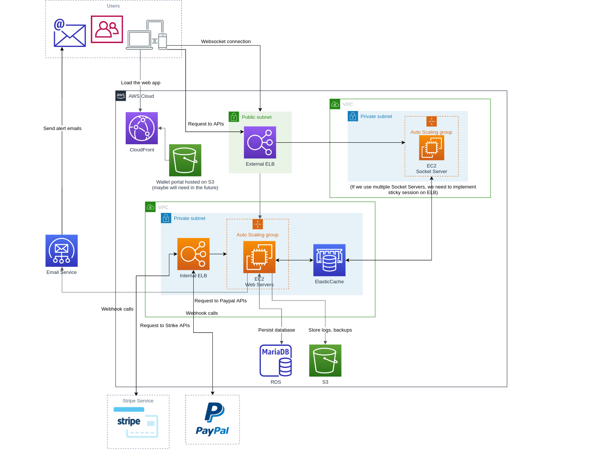

# Gamelancer

### Architecture Diagram


### Pre-requisites

  - PHP >= 7.0.0
  - MySQL
  - Composer
  - Node JS
  - Redis
  - Laravel-echo-server
  - Docker
  - make

### First time setup
  - Init submodules
```sh
$ git submodule update --init
```

  - copy .env file from .env.example and then change database configuration
```sh
$ cp .env.example .env
```
  - install composer modules. You'll need to run this command again if there's any update in the file composer.json
```sh
$ composer install
```
- Generate application key
```sh
$ php artisan key:generate
```
- Init database
```sh
$ php artisan migrate
$ php artisan db:seed
```
- Link storage folder
```sh
$ php artisan storage:link
```
- Generate passport keys
```sh
$ php artisan passport:keys
```
- Install Laravel-echo-server
```sh
$ sudo npm install -g laravel-echo-server
$ cp laravel-echo-server.json.example laravel-echo-server.json
```
### Compiling assets
We use Laravel Mix and webpack to manage and version our assets (javascript, css). Here's how to to do it:
  - Install node modules. You only need to run this command again if there's any update in the file package.json
```sh
$ npm install
```
  - Compile assets
```sh
$ npm run dev
```
  - If you dont want to run the above command every time you update a javscript or css file, you can use the following command to watch and compile automatically
```sh
$ npm run watch
```

### Test it out
- Run redis cache
```sh
$ redis-server
```
- Run Socket.IO server
```sh
$ laravel-echo-server start
```
- Run web server
```sh
$ php artisan serve
```

### Other commands you might find usefull
- Create new table
```sh
$ php artisan make:migration create_companies_table --create=companies
```

### Coding convention

- Indentation: 2 spaces for html/js and 4 spaces for php/css
- No trailing space
- Defining constants inside app/Consts.php and utility functions

- JS: `npm test`
- PHP:
  - `vendor/bin/phpcs --standard=phpcs.xml`
  - `vendor/bin/phpmd app text phpmd.xml`

### Shortcut

```shell
make init-db-full     # Reset databse
make docker-restart   # Restart docker and database
make deploy-dev n=2   # Deploy to test server number 2
make generate-master  # Generate new master data json file (only run this after you modified master data Google sheet)
make update-master    # Update master data
make log              # Tail Laravel log
make test-js          # Check standard *.js
make test-php         # Check standard *.php
make build            # Build assets (*.js, *css)
make watch            # Watch assets (*.js, *css)
make autoload         # Reload *.php
make cache            # Clear cache
make route            # List routes
```

### Using docker
Actually you can ignore all the above steps if you want to use Docker LOL.

- Start the docker containers:
```sh
$ make docker-start
```

- First time install
```sh
$ make docker-init
```

- Compile assets
```sh
$ make watch
```

### How to explicitly specify master database for MySQL queries
We use database replication in our project in which we have 1 master and possibly multiple slave databases. By default, we read from slave and write to master. However, the replication process from master to slave take up to few seconds. Thus, in certain circumstances, you might wanna read from master directly to avoid this delay. Here's how:
- Eloquent
```
User::on('master')->find(1);
```
- Query builder
```
DB::connection('master')->table('users')->find(1);
```

### How to test your API with Postman
In order to request an protected restful API, you need an OAuth 2 access token. Here's how:
- First, create a Password Grant Client
```
$ php artisan passport:client --password
```
- Then you can generate a Personal Access Token for any user by making a Post request like this: https://laravel.com/docs/5.5/passport#requesting-tokens


### How to use signed requests

#### Protect endpoints by authorize request params under HMAC

```php
// Add middleware auth:api and auth.message to the endpoint that need to be proteced under HMAC
Route::group(['middleware' => ['auth:api', 'auth.message']], function () {
    // Protected endpoint definations
});
```
